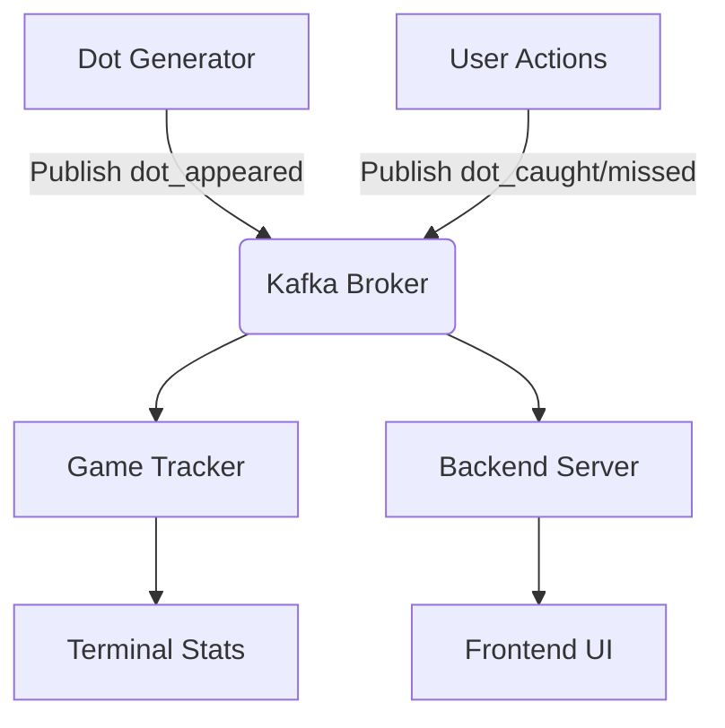

# Dot Catcher Game

A real-time interactive game built with Python, Kafka, and React where players catch randomly appearing dots on a 5x5 grid.

## Game Overview

Dot Catcher is an engaging game where dots randomly appear on a 5x5 grid and players must click on them before they disappear. The game features real-time scoring, win/lose conditions, and a sleek user interface.

### Game Mechanics
- Dots appear randomly on a 5x5 grid every 0.5-2 seconds
- Players must click on dots to catch them before they disappear (2 seconds)
- Win condition: Reach 10 points
- Lose condition: Miss 5 dots
- Real-time score tracking and progress visualization

## System Architecture

The game follows a microservices architecture with Kafka as the messaging backbone:



### Core Components

1. **Dot Generator** (`dot_catcher/backend/dot_generator.py`)
   - Python service that generates random dots on the grid
   - Publishes dot appearance events to Kafka "dots" topic
   - Runs continuously with randomized intervals (0.5-2 seconds)

2. **Game Tracker** (`dot_catcher/backend/game_tracker.py`)
   - Kafka consumer that subscribes to both "dots" and "actions" topics
   - Tracks game state including scores, misses, and timing
   - Outputs game statistics to terminal

3. **Backend Server** (`dot_catcher/backend/server.py`)
   - Flask server with WebSocket support (Socket.IO)
   - Manages game state and win/lose conditions
   - Bridges Kafka events with frontend via WebSocket
   - Handles user actions and broadcasts updates

4. **Frontend** (`frontend/`)
   - React application built with Vite
   - Real-time UI that updates via WebSocket
   - Interactive 5x5 grid with visual feedback
   - Progress bars for score and misses

## Quick Start

### Prerequisites

- Python 3.8+
- Node.js 16+
- Kafka 3.6.0
- Zookeeper (comes with Kafka)

### One-Command Setup

```bash
# Navigate to project directory
cd /Users/lobsangtseten/Desktop/IntelliMove

# Start all services with one command
./start_game.sh
```

### Manual Setup Steps

1. **Start Message Broker**
   ```bash
   # Terminal 1: Start Zookeeper
   ~/kafka/bin/zookeeper-server-start.sh ~/kafka/config/zookeeper.properties
   
   # Terminal 2: Start Kafka
   ~/kafka/bin/kafka-server-start.sh ~/kafka/config/server.properties
   ```

2. **Initialize Topics**
   ```bash
   # Create required Kafka topics
   ~/kafka/bin/kafka-topics.sh --create --topic dots --bootstrap-server localhost:9092
   ~/kafka/bin/kafka-topics.sh --create --topic actions --bootstrap-server localhost:9092
   ```

3. **Launch Backend Services**
   ```bash
   # Terminal 3: Game Tracker
   cd dot_catcher/backend && python game_tracker.py
   
   # Terminal 4: Backend Server
   cd dot_catcher/backend && python server.py
   
   # Terminal 5: Dot Generator
   cd dot_catcher/backend && python dot_generator.py
   ```

4. **Start Frontend**
   ```bash
   # Terminal 6: Frontend
   cd frontend && npm run dev
   ```

## How to Play

1. Open your browser and navigate to: `http://localhost:5173`
2. Dots will randomly appear on the 5x5 grid as colored circles
3. Click on dots quickly to catch them before they disappear (2 seconds)
4. Track your progress with the score and mistake counters
5. Win by reaching 10 points before missing 5 dots
6. Use the "Reset Game" button to start over

### Game Controls
- **Mouse Click**: Catch a dot
- **Reset Button**: Restart the game
- **Progress Bars**: Visual indicators for score and mistakes

## Project Structure

```
IntelliMove/
├── dot_catcher/
│   └── backend/
│       ├── dot_generator.py      # Generates random dots
│       ├── game_tracker.py       # Tracks game state
│       ├── server.py             # Main backend server
│       └── action_handler.py     # Handles user actions
├── frontend/
│   ├── src/
│   │   ├── App.jsx               # Main game component
│   │   ├── App.css               # Game styles
│   │   └── main.jsx              # Entry point
│   ├── package.json              # Frontend dependencies
│   └── vite.config.js            # Vite configuration
├── start_game.sh                 # Start all services script
└── stop_game.sh                  # Stop all services script
```

## Technical Specifications

### Kafka Event Schema

**Dots Topic** (`dots`):
```json
{
  "event_type": "dot_appeared",
  "position": [x, "y"],
  "timestamp": "ISO_TIMESTAMP"
}
```

**Actions Topic** (`actions`):
```json
{
  "event_type": "dot_caught"|"dot_missed",
  "position": [x, "y"],
  "timestamp": "ISO_TIMESTAMP"
}
```

### WebSocket Communication

- **Incoming Events**:
  - `catch_dot`: User action when clicking a dot
  
- **Outgoing Events**:
  - `dot_appeared`: New dot appears on grid
  - `game_state_update`: Score/miss updates
  - `game_over`: Win/lose condition reached
  - `game_reset`: Game restart notification

### Service Ports

| Service | Port |
|---------|------|
| Zookeeper | 2181 |
| Kafka | 9092 |
| Backend Server | 5001 |
| Frontend Dev Server | 5173 |

## Development Guide

### Backend Extension

1. **Adding Game Features**
   ```python
   # In server.py
   game_state = {
       'score': 0,
       'misses': 0,
       'game_over': False,
       'target_score': 10,
       'max_misses': 5
   }
   ```

2. **Creating New Events**
   - Define new event schema in Kafka topics
   - Update consumers to handle new event types
   - Modify frontend to visualize new events

### Frontend Customization

1. **UI Theming**
   ```css
   /* In App.css */
   .grid-cell {
     background-color: #61dafb; /* Customize dot color */
   }
   ```

2. **Game Grid Modification**
   - Adjust `GRID_SIZE` in both frontend and backend
   - Update CSS for responsive grid layout
   - Modify game logic for new dimensions

## Contributing

1. Fork the repository
2. Create your feature branch (`git checkout -b feature/AmazingFeature`)
3. Commit your changes (`git commit -m 'Add some AmazingFeature'`)
4. Push to the branch (`git push origin feature/AmazingFeature`)
5. Open a pull request

## Troubleshooting

### Common Issues

1. **Port Conflicts**
   ```bash
   # Kill existing processes
   ./stop_game.sh
   pkill -f kafka
   pkill -f zookeeper
   ```

2. **Kafka Not Starting**
   ```bash
   # Clear Kafka data directories
   rm -rf /tmp/zookeeper /tmp/kafka-logs
   ```

3. **Frontend Not Loading**
   ```bash
   # Check if frontend is running
   cd frontend && npm run dev
   ```

### Logs and Debugging

- **Backend Logs**: Check terminal outputs for each service
- **Frontend Logs**: Browser developer console
- **Kafka Logs**: `~/kafka/logs/` directory

## License

This project is licensed under the MIT License.

## Acknowledgments

- Built with Apache Kafka for reliable event streaming
- React and Vite for modern frontend development
- Flask-SocketIO for real-time WebSocket communication
- Special thanks to all open-source contributors